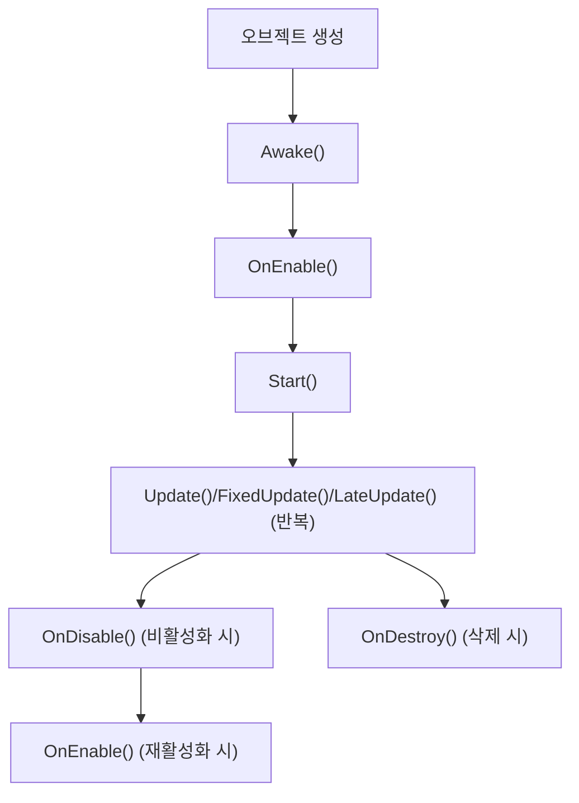

# 유니티 2D 게임 개발 노션용 메모

## Input System 기반 2D 플레이어 이동 구현

### 1. Input System 패키지 설치
- Window → Package Manager → Input System 설치

### 2. Input Actions 에셋 생성
- Assets 폴더에서 우클릭 → Create → Input Actions → 이름: `PlayerControls.inputactions`
- 더블클릭하여 Input Actions 창 열기
- Action Map 추가: `Player`
- Move 액션 추가: Action Type: Value, Control Type: Vector2
- 바인딩 추가: Up/Down/Left/Right [Keyboard] 선택 (WASD/방향키 자동 바인딩)

### 3. PlayerMovement 스크립트 예시
```csharp
using UnityEngine;
using UnityEngine.InputSystem;

public class PlayerMovement : MonoBehaviour
{
    public float moveSpeed = 5f;
    private Vector2 moveInput;
    private PlayerControls controls;

    private void Awake()
    {
        controls = new PlayerControls();
        controls.Player.Move.performed += ctx => moveInput = ctx.ReadValue<Vector2>();
        controls.Player.Move.canceled += ctx => moveInput = Vector2.zero;
    }

    private void OnEnable()
    {
        controls.Player.Enable();
    }

    private void OnDisable()
    {
        controls.Player.Disable();
    }

    void Update()
    {
        transform.Translate(moveInput.normalized * moveSpeed * Time.deltaTime);
    }
}
```

### 4. PlayerControls C# 클래스 자동 생성
- PlayerControls.inputactions 파일 저장 시 자동 생성
- 안 되면 Inspector에서 "Generate C# Class" 버튼 클릭

### 5. 테스트
- Player 오브젝트에 PlayerMovement 스크립트가 붙어있는지 확인
- 플레이 버튼(▶️) 클릭 후 WASD/방향키로 이동 확인

---

## 에러/문제 해결 팁

### Input 관련 에러
- 에러: "You are trying to read Input using the UnityEngine.Input class, but you have switched active Input handling to Input System package in Player Settings."
- 원인: Project Settings > Player > Active Input Handling이 Input System Only로 되어있을 때 기존 Input 코드 사용 시 발생
- 해결: Input System 방식으로 코드 작성하거나, 임시로 Active Input Handling을 Both로 변경

---

## 유니티 오브젝트/컴포넌트의 생성주기(생명주기)

### 주요 생명주기 함수

- **Awake()**
  - 오브젝트가 씬에 생성될 때(활성화될 때) 가장 먼저 한 번 호출
  - 참조 설정 등 초기화에 사용
- **OnEnable()**
  - 오브젝트가 활성화될 때(Awake 다음) 호출
  - 비활성화됐다가 다시 활성화될 때마다 호출
- **Start()**
  - 오브젝트가 씬에 활성화된 후, 첫 프레임 전에 한 번 호출
  - 초기화 코드에 주로 사용
- **Update()**
  - 매 프레임마다 호출 (게임 내 지속 처리 로직)
- **FixedUpdate()**
  - 물리 연산 관련 처리를 고정된 시간 간격으로 호출
- **LateUpdate()**
  - Update()가 모두 끝난 후, 매 프레임마다 호출 (카메라 추적 등)
- **OnDisable()**
  - 오브젝트가 비활성화될 때 호출
- **OnDestroy()**
  - 오브젝트가 씬에서 제거될 때 호출

### 전체 흐름 요약



### 실전 예시 코드

```csharp
void Awake() { Debug.Log("Awake"); }
void OnEnable() { Debug.Log("OnEnable"); }
void Start() { Debug.Log("Start"); }
void Update() { Debug.Log("Update"); }
void FixedUpdate() { Debug.Log("FixedUpdate"); }
void LateUpdate() { Debug.Log("LateUpdate"); }
void OnDisable() { Debug.Log("OnDisable"); }
void OnDestroy() { Debug.Log("OnDestroy"); }
```

### 요약
- Awake → OnEnable → Start → (Update/FixedUpdate/LateUpdate 반복) → OnDisable/OnDestroy
- 필요한 함수만 선언해서 사용하면 됨

---

> 이 파일은 유니티 2D 게임 개발 중 중요한 팁, 단계별 가이드, 자주 발생하는 문제와 해결법 등을 노션에 정리해두는 용도로 사용하세요.
> 추가로 저장할 내용이 있으면 언제든 말씀해 주세요! 